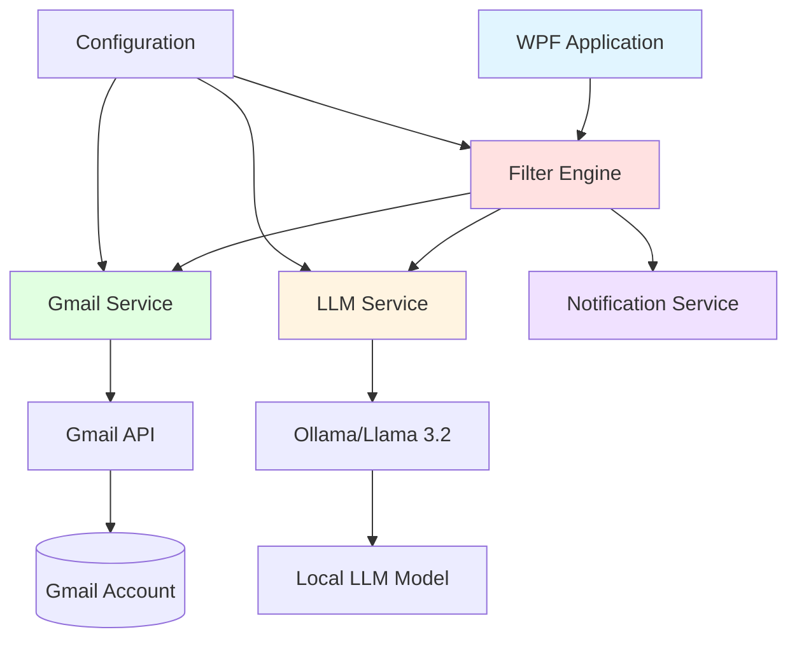
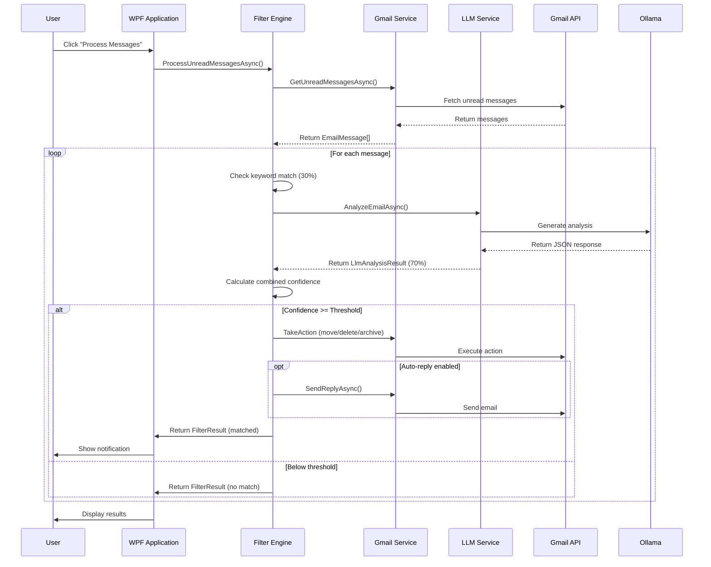
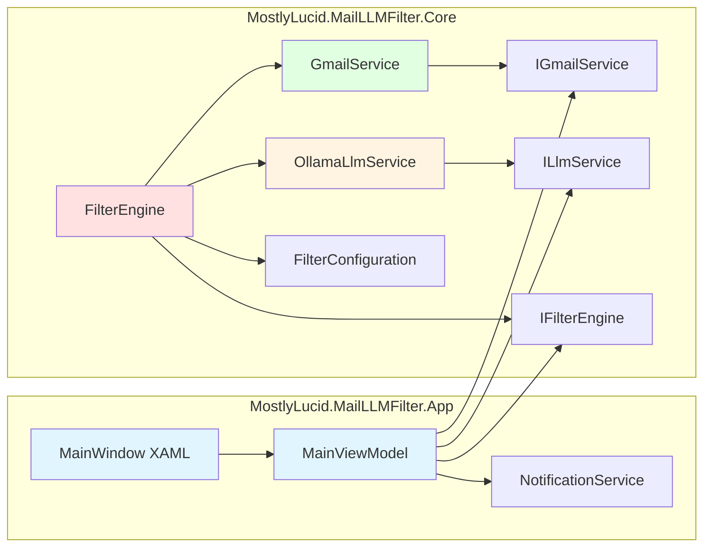
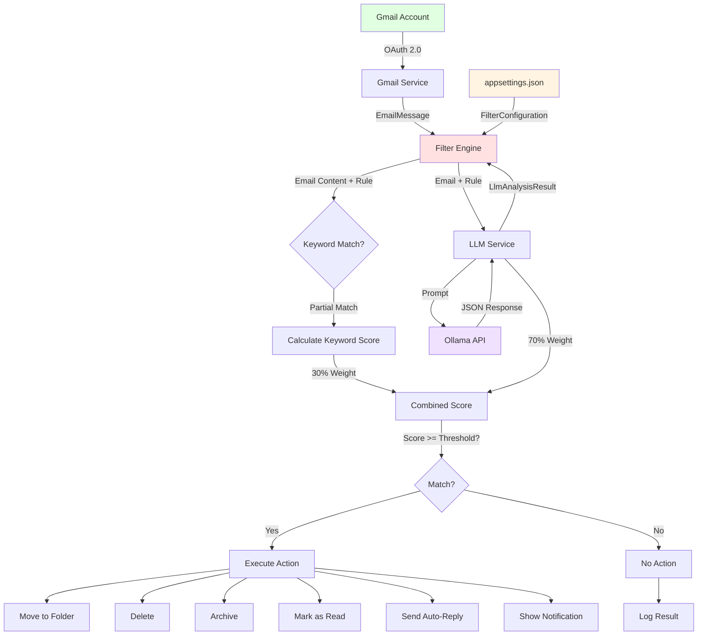

# MostlyLucid Mail LLM Filter

A sophisticated Windows application that uses AI-powered email analysis to automatically filter, categorize, and respond to Gmail messages. Built with .NET 9, WPF, and Ollama (Llama 3.2).

## Table of Contents

- [Overview](#overview)
- [Architecture](#architecture)
- [System Requirements](#system-requirements)
- [Complete Setup Guide](#complete-setup-guide)
- [Configuration Reference](#configuration-reference)
- [Source Code Structure](#source-code-structure)
- [How It Works](#how-it-works)
- [Usage Guide](#usage-guide)
- [Troubleshooting](#troubleshooting)
- [Privacy & Security](#privacy--security)

---

## Overview

This application intelligently processes Gmail messages by combining traditional keyword matching with advanced LLM-powered content analysis. It can automatically:

- Filter emails meant for someone else (e.g., "Prof. Galloway" when you're not Prof. Galloway)
- Identify and handle spam, marketing, and newsletters
- Automatically reply to filtered messages with customizable templates
- Move messages to appropriate folders based on content and confidence scores
- Notify you via Windows toast notifications

### Key Features

- **Hybrid Filtering**: Combines keyword matching (30%) + LLM analysis (70%) for accurate filtering
- **Configurable Rules**: JSON-based filter rules with keywords, topics, mentions, and custom prompts
- **Multiple Actions**: Move to folder, delete, mark as read, archive
- **Auto-Reply System**: Template-based automated responses with placeholders
- **Auto-Check Mode**: Continuous monitoring at configurable intervals
- **Windows Integration**: Native WPF UI with toast notifications
- **Privacy-First**: All processing happens locally, no external LLM services

---

## Architecture

### High-Level Architecture



### Email Processing Flow



### Component Architecture



### Data Flow



---

## System Requirements

### Software Requirements

- **Operating System**: Windows 10 version 1809 or later, Windows 11
- **.NET SDK**: .NET 9.0 SDK or later ([Download](https://dotnet.microsoft.com/download/dotnet/9.0))
- **Ollama**: Latest version ([Download](https://ollama.ai/))
- **LLM Model**: Llama 3.2 (pulled via Ollama)
- **Gmail Account**: With API access enabled

### Hardware Requirements

- **RAM**: 8 GB minimum (16 GB recommended for LLM processing)
- **Storage**: 10 GB free space (for LLM model and application)
- **Internet**: Required for Gmail API access and initial setup

---

## Complete Setup Guide

### Step 1: Install Prerequisites

#### 1.1 Install .NET 9.0 SDK

```bash
# Check if already installed
dotnet --version

# Should output: 9.0.x or later
```

If not installed, download from: https://dotnet.microsoft.com/download/dotnet/9.0

#### 1.2 Install Ollama

1. Download Ollama from https://ollama.ai/
2. Run the installer
3. Verify installation:

```bash
ollama --version
```

#### 1.3 Pull Llama 3.2 Model

```bash
# Pull the model (this will download ~2GB)
ollama pull llama3.2

# Verify the model is available
ollama list

# Test the model
ollama run llama3.2 "Hello, are you working?"
```

### Step 2: Set Up Gmail API Access

This is the most important step. Follow carefully:

#### 2.1 Create Google Cloud Project

1. Go to [Google Cloud Console](https://console.cloud.google.com/)
2. Click **"Select a project"** dropdown at the top
3. Click **"New Project"**
4. Enter project name: `MailLLMFilter` (or your choice)
5. Click **"Create"**
6. Wait for project creation (notification will appear)

#### 2.2 Enable Gmail API

1. In the Cloud Console, ensure your new project is selected
2. Click the **hamburger menu** (☰) → **"APIs & Services"** → **"Library"**
3. In the search box, type: `Gmail API`
4. Click on **"Gmail API"** in the results
5. Click the blue **"Enable"** button
6. Wait for activation (usually 1-2 minutes)

#### 2.3 Configure OAuth Consent Screen

**IMPORTANT**: This step is required before creating credentials.

1. Go to **"APIs & Services"** → **"OAuth consent screen"**
2. Select **"External"** user type (unless you have a Google Workspace)
3. Click **"Create"**
4. Fill in the required fields:
   - **App name**: `MostlyLucid Mail LLM Filter`
   - **User support email**: Your email address
   - **Developer contact information**: Your email address
5. Click **"Save and Continue"**
6. On **"Scopes"** screen, click **"Add or Remove Scopes"**
7. Filter for Gmail scopes and add:
   - `.../auth/gmail.modify` - Read, compose, send, and permanently delete emails
   - `.../auth/gmail.send` - Send email on your behalf
8. Click **"Update"** then **"Save and Continue"**
9. On **"Test users"** screen, click **"Add Users"**
10. Add your Gmail address
11. Click **"Save and Continue"**
12. Review and click **"Back to Dashboard"**

#### 2.4 Create OAuth Credentials

1. Go to **"APIs & Services"** → **"Credentials"**
2. Click **"+ Create Credentials"** at the top
3. Select **"OAuth client ID"**
4. For Application type, select **"Desktop app"**
5. Name: `Mail LLM Filter Client`
6. Click **"Create"**
7. A dialog appears with your Client ID and Secret
8. Click **"Download JSON"**
9. Save the file

#### 2.5 Save Credentials File

1. Rename the downloaded file to `credentials.json`
2. Copy it to your application directory:

```bash
# If you cloned the repo
cp ~/Downloads/client_secret_*.json /path/to/mostlylucid.maillmfilter/credentials.json

# Or copy to the build output directory after building
cp credentials.json src/MostlyLucid.MailLLMFilter.App/bin/Debug/net9.0-windows/
```

**CRITICAL**: The `credentials.json` must be in the same directory as the running executable.

### Step 3: Clone and Build Application

```bash
# Clone the repository
git clone https://github.com/scottgal/mostlylucid.maillmfilter.git
cd mostlylucid.maillmfilter

# Restore dependencies
dotnet restore

# Build the solution
dotnet build --configuration Release

# Output will be in: src/MostlyLucid.MailLLMFilter.App/bin/Release/net9.0-windows/
```

### Step 4: Configure Filter Rules

Edit `appsettings.json` in the application directory (or copy the example):

```bash
# Copy appsettings.json to build directory
cp appsettings.json src/MostlyLucid.MailLLMFilter.App/bin/Release/net9.0-windows/
```

See [Configuration Reference](#configuration-reference) below for detailed options.

### Step 5: First Run

```bash
# Run the application
cd src/MostlyLucid.MailLLMFilter.App/bin/Release/net9.0-windows/
./MostlyLucid.MailLLMFilter.App.exe
```

**First-time OAuth Flow**:

1. Click **"Connect to Gmail"** button
2. Your default browser will open
3. You may see a warning: **"Google hasn't verified this app"**
   - Click **"Advanced"**
   - Click **"Go to MostlyLucid Mail LLM Filter (unsafe)"**
   - This is safe - it's your own app
4. Select your Gmail account
5. Review permissions:
   - Read, compose, send, and permanently delete emails
   - Send email on your behalf
6. Click **"Continue"**
7. Browser will show: **"Authentication complete. You can close this window."**
8. Return to the application - it should now show **"Connected to Gmail"**

The OAuth token is stored in: `%APPDATA%\MostlyLucid.MailLLMFilter\token.json`

---

## Configuration Reference

### Complete `appsettings.json` Schema

```json
{
  "FilterConfiguration": {
    "Ollama": {
      "Endpoint": "http://localhost:11434",
      "Model": "llama3.2",
      "Temperature": 0.3,
      "MaxTokens": 500
    },
    "Gmail": {
      "CredentialsPath": "credentials.json",
      "FilteredLabel": "Filtered",
      "CheckIntervalSeconds": 60,
      "MaxMessagesPerCheck": 50
    },
    "FilterRules": [
      {
        "Name": "Rule Name",
        "Enabled": true,
        "Keywords": ["keyword1", "keyword2"],
        "Topics": ["topic1", "topic2"],
        "Mentions": ["Prof. Galloway"],
        "ConfidenceThreshold": 0.7,
        "Action": "MoveToFolder",
        "TargetFolder": "FolderName",
        "AutoReplyTemplateId": "template-id",
        "CustomPrompt": "Optional custom LLM prompt"
      }
    ],
    "AutoReplyTemplates": [
      {
        "Id": "template-id",
        "Name": "Template Name",
        "Subject": "Re: {originalSubject}",
        "Body": "Email body with {sender} placeholder",
        "IncludeOriginal": false
      }
    ]
  },
  "Logging": {
    "LogLevel": {
      "Default": "Information",
      "Microsoft": "Warning",
      "System": "Warning"
    }
  }
}
```

### Configuration Options Explained

#### Ollama Settings

| Option | Type | Default | Description |
|--------|------|---------|-------------|
| `Endpoint` | string | `http://localhost:11434` | Ollama API endpoint URL |
| `Model` | string | `llama3.2` | LLM model name (must be pulled via `ollama pull`) |
| `Temperature` | float | `0.3` | LLM temperature (0.0-1.0). Lower = more deterministic |
| `MaxTokens` | int | `500` | Maximum tokens in LLM response |

**Temperature Guide**:
- `0.0-0.3`: Very consistent, factual responses (recommended for filtering)
- `0.4-0.7`: Balanced creativity and consistency
- `0.8-1.0`: Creative, varied responses (not recommended for filtering)

#### Gmail Settings

| Option | Type | Default | Description |
|--------|------|---------|-------------|
| `CredentialsPath` | string | `credentials.json` | Path to Gmail OAuth credentials file |
| `FilteredLabel` | string | `Filtered` | Default Gmail label for filtered messages (created if doesn't exist) |
| `CheckIntervalSeconds` | int | `60` | Auto-check interval in seconds (minimum: 10) |
| `MaxMessagesPerCheck` | int | `50` | Maximum unread messages to process per check |

#### Filter Rule Options

| Option | Type | Required | Description |
|--------|------|----------|-------------|
| `Name` | string | ✅ | Unique identifier for the rule |
| `Enabled` | bool | ✅ | Whether the rule is active |
| `Keywords` | string[] | ❌ | Keywords for simple matching (case-insensitive) |
| `Topics` | string[] | ❌ | Topics for LLM-based analysis |
| `Mentions` | string[] | ❌ | Specific phrases/names to look for |
| `ConfidenceThreshold` | float | ✅ | Minimum confidence (0.0-1.0) to trigger action |
| `Action` | enum | ✅ | Action to take: `MoveToFolder`, `Delete`, `MarkAsRead`, `Archive` |
| `TargetFolder` | string | ⚠️ | Required if `Action` is `MoveToFolder` |
| `AutoReplyTemplateId` | string | ❌ | ID of auto-reply template to use |
| `CustomPrompt` | string | ❌ | Custom LLM prompt (overrides default) |

**Action Types**:
- `MoveToFolder`: Move to specified Gmail label (creates label if doesn't exist)
- `Delete`: Move to Gmail trash
- `MarkAsRead`: Remove UNREAD label
- `Archive`: Remove from INBOX (keeps in All Mail)

**Confidence Threshold Guide**:
- `0.5-0.6`: Lenient - catches more but may have false positives
- `0.7-0.8`: Balanced - recommended for most use cases
- `0.9-1.0`: Strict - only very confident matches

#### Auto-Reply Template Options

| Option | Type | Required | Description |
|--------|------|----------|-------------|
| `Id` | string | ✅ | Unique identifier for the template |
| `Name` | string | ✅ | Descriptive name |
| `Subject` | string | ✅ | Email subject line (supports placeholders) |
| `Body` | string | ✅ | Email body (supports placeholders) |
| `IncludeOriginal` | bool | ✅ | Whether to include original message in reply |

**Available Placeholders**:
- `{sender}`: Sender's name (or email if name unavailable)
- `{originalSubject}`: Original email subject

### Example Configurations

#### Example 1: Misdirected Emails with Auto-Reply

```json
{
  "Name": "Prof. Galloway Misdirected Emails",
  "Enabled": true,
  "Keywords": ["professor", "prof", "galloway", "academic"],
  "Topics": ["academic", "university", "course", "assignment", "grade"],
  "Mentions": ["Prof. Galloway", "Professor Galloway", "Dr. Galloway", "Prof Galloway"],
  "ConfidenceThreshold": 0.75,
  "Action": "MoveToFolder",
  "TargetFolder": "NotForMe/Prof_Galloway",
  "AutoReplyTemplateId": "not-prof-galloway",
  "CustomPrompt": "Analyze if this email is meant for Prof. Galloway or someone in academia. Look for context clues like course numbers, office hours, assignments, or direct addressing. Be very confident before matching."
}
```

#### Example 2: Aggressive Spam Filter

```json
{
  "Name": "Aggressive Spam Filter",
  "Enabled": true,
  "Keywords": [
    "unsubscribe", "click here", "act now", "limited time",
    "congratulations", "you've won", "free gift", "earn money",
    "weight loss", "miracle", "guarantee"
  ],
  "Topics": ["marketing", "advertisement", "spam", "phishing", "scam"],
  "Mentions": [],
  "ConfidenceThreshold": 0.85,
  "Action": "Delete",
  "CustomPrompt": "Determine if this is spam, phishing, or unwanted marketing. Look for aggressive sales language, suspicious links, too-good-to-be-true offers, or unsolicited promotions. Only match if very confident it's spam."
}
```

#### Example 3: Newsletter Organizer

```json
{
  "Name": "Newsletter Archive",
  "Enabled": true,
  "Keywords": ["newsletter", "digest", "weekly roundup", "monthly update"],
  "Topics": ["newsletter", "digest", "update", "roundup"],
  "Mentions": [],
  "ConfidenceThreshold": 0.6,
  "Action": "MoveToFolder",
  "TargetFolder": "Newsletters"
}
```

#### Example 4: Work-Related Auto-Reply

```json
{
  "FilterRules": [
    {
      "Name": "Out of Office - Work Emails",
      "Enabled": true,
      "Keywords": ["project", "meeting", "deadline", "urgent"],
      "Topics": ["work", "business", "project management"],
      "ConfidenceThreshold": 0.7,
      "Action": "MarkAsRead",
      "AutoReplyTemplateId": "out-of-office"
    }
  ],
  "AutoReplyTemplates": [
    {
      "Id": "out-of-office",
      "Name": "Out of Office Auto-Reply",
      "Subject": "Re: {originalSubject} - Out of Office",
      "Body": "Hello {sender},\n\nThank you for your email. I am currently out of office and will have limited access to email.\n\nI will respond to your message when I return.\n\nBest regards",
      "IncludeOriginal": false
    }
  ]
}
```

---

## Source Code Structure

### Project Organization

```
mostlylucid.maillmfilter/
├── src/
│   ├── MostlyLucid.MailLLMFilter.Core/           # Core business logic library
│   │   ├── Configuration/
│   │   │   └── FilterConfiguration.cs             # Configuration models
│   │   ├── Models/
│   │   │   ├── EmailMessage.cs                    # Email representation
│   │   │   └── FilterResult.cs                    # Filter result models
│   │   ├── Services/
│   │   │   ├── ILlmService.cs                     # LLM service interface
│   │   │   ├── OllamaLlmService.cs                # Ollama implementation
│   │   │   ├── IGmailService.cs                   # Gmail service interface
│   │   │   ├── GmailService.cs                    # Gmail API implementation
│   │   │   ├── IFilterEngine.cs                   # Filter engine interface
│   │   │   └── FilterEngine.cs                    # Main filtering logic
│   │   └── MostlyLucid.MailLLMFilter.Core.csproj
│   │
│   └── MostlyLucid.MailLLMFilter.App/             # WPF Windows application
│       ├── Services/
│       │   └── NotificationService.cs             # Windows toast notifications
│       ├── ViewModels/
│       │   └── MainViewModel.cs                   # Main window view model (MVVM)
│       ├── Views/
│       │   ├── MainWindow.xaml                    # Main UI layout
│       │   └── MainWindow.xaml.cs                 # Main window code-behind
│       ├── Converters/
│       │   └── InverseBooleanConverter.cs         # XAML value converter
│       ├── App.xaml                               # Application resources
│       ├── App.xaml.cs                            # Application startup & DI
│       └── MostlyLucid.MailLLMFilter.App.csproj
│
├── appsettings.json                               # Configuration file
├── credentials.json                               # Gmail OAuth credentials (gitignored)
├── MostlyLucid.MailLLMFilter.sln                  # Solution file
├── .gitignore
├── LICENSE
└── README.md
```

### Key Classes and Their Responsibilities

#### Core Library (`MostlyLucid.MailLLMFilter.Core`)

**Configuration/FilterConfiguration.cs**
- Location: `src/MostlyLucid.MailLLMFilter.Core/Configuration/FilterConfiguration.cs`
- Classes:
  - `FilterConfiguration`: Root configuration
  - `OllamaSettings`: Ollama/LLM settings
  - `GmailSettings`: Gmail API settings
  - `FilterRule`: Individual filter rule
  - `FilterAction`: Enum for actions
  - `AutoReplyTemplate`: Auto-reply template
- Purpose: Defines all configuration models

**Models/EmailMessage.cs**
- Location: `src/MostlyLucid.MailLLMFilter.Core/Models/EmailMessage.cs:5`
- Class: `EmailMessage`
- Properties: Id, ThreadId, From, FromName, To, Subject, Body, ReceivedDate, Labels, IsUnread, Snippet
- Purpose: Represents a Gmail message

**Models/FilterResult.cs**
- Location: `src/MostlyLucid.MailLLMFilter.Core/Models/FilterResult.cs:7`
- Classes:
  - `FilterResult`: Result of filtering an email
  - `LlmAnalysisResult`: LLM analysis details
- Purpose: Contains filtering results and analysis

**Services/ILlmService.cs** & **OllamaLlmService.cs**
- Location: `src/MostlyLucid.MailLLMFilter.Core/Services/OllamaLlmService.cs:14`
- Interface: `ILlmService`
- Implementation: `OllamaLlmService`
- Key Methods:
  - `AnalyzeEmailAsync()`: Analyzes email against a filter rule
  - `IsAvailableAsync()`: Checks if Ollama service is available
- Dependencies: OllamaSharp NuGet package
- Purpose: Integrates with Ollama for LLM-powered analysis

**Services/IGmailService.cs** & **GmailService.cs**
- Location: `src/MostlyLucid.MailLLMFilter.Core/Services/GmailService.cs:19`
- Interface: `IGmailService`
- Implementation: `GmailService`
- Key Methods:
  - `InitializeAsync()`: Authenticates with Gmail via OAuth 2.0
  - `GetUnreadMessagesAsync()`: Fetches unread messages
  - `MoveToLabelAsync()`: Moves message to label/folder
  - `DeleteMessageAsync()`: Deletes (trashes) a message
  - `MarkAsReadAsync()`: Marks message as read
  - `ArchiveMessageAsync()`: Archives a message
  - `SendReplyAsync()`: Sends an auto-reply email
- Dependencies: Google.Apis.Gmail.v1 NuGet package
- Purpose: Handles all Gmail API operations

**Services/IFilterEngine.cs** & **FilterEngine.cs**
- Location: `src/MostlyLucid.MailLLMFilter.Core/Services/FilterEngine.cs:12`
- Interface: `IFilterEngine`
- Implementation: `FilterEngine`
- Key Methods:
  - `FilterMessageAsync()`: Filters a single email
  - `ProcessUnreadMessagesAsync()`: Processes all unread messages
  - `CheckKeywordMatch()` (private): Performs keyword matching
  - `TakeActionAsync()` (private): Executes filter actions
  - `SendAutoReplyAsync()` (private): Sends auto-reply
- Algorithm:
  1. Check keywords (30% weight)
  2. Get LLM analysis (70% weight)
  3. Calculate combined confidence
  4. If >= threshold, execute action
- Purpose: Coordinates filtering process

#### Application (`MostlyLucid.MailLLMFilter.App`)

**App.xaml.cs**
- Location: `src/MostlyLucid.MailLLMFilter.App/App.xaml.cs:14`
- Class: `App : Application`
- Key Methods:
  - `OnStartup()`: Sets up dependency injection, configuration, services
  - `OnExit()`: Cleans up resources
- DI Container: Microsoft.Extensions.Hosting
- Configuration: Loads from `appsettings.json`
- Purpose: Application entry point and DI setup

**ViewModels/MainViewModel.cs**
- Location: `src/MostlyLucid.MailLLMFilter.App/ViewModels/MainViewModel.cs:12`
- Class: `MainViewModel : ObservableObject`
- Pattern: MVVM (Model-View-ViewModel)
- Properties:
  - `IsConnected`: Gmail connection status
  - `IsProcessing`: Processing state
  - `AutoCheckEnabled`: Auto-check toggle
  - `AutoCheckInterval`: Interval in seconds
  - `StatusMessage`: Status bar text
  - `FilterResults`: Observable collection of results
  - `SelectedResult`: Currently selected result
- Commands (RelayCommand):
  - `ConnectAsync`: Initiates Gmail OAuth
  - `ProcessMessagesAsync`: Processes unread emails
  - `ToggleAutoCheck`: Enables/disables auto-check
  - `OpenSettings`: Opens settings (not implemented)
- Dependencies: IGmailService, ILlmService, IFilterEngine, NotificationService
- Purpose: UI logic and state management

**Services/NotificationService.cs**
- Location: `src/MostlyLucid.MailLLMFilter.App/Services/NotificationService.cs:8`
- Class: `NotificationService`
- Methods:
  - `ShowFilteredMessageNotification()`: Shows notification for filtered email
  - `ShowBatchProcessedNotification()`: Shows batch summary
  - `ShowErrorNotification()`: Shows error
  - `ShowInfoNotification()`: Shows info message
- Dependencies: Microsoft.Toolkit.Uwp.Notifications
- Purpose: Windows 10/11 toast notifications

**Views/MainWindow.xaml**
- Location: `src/MostlyLucid.MailLLMFilter.App/Views/MainWindow.xaml`
- Type: WPF Window (XAML)
- Layout:
  - Header: Connection and action buttons
  - Main: DataGrid for results + details panel (GridSplitter)
  - Footer: Status bar with progress indicator
- Data Binding: Binds to MainViewModel
- Purpose: User interface

### NuGet Dependencies

**Core Library:**
- `Google.Apis.Gmail.v1` (1.68.0.3582): Gmail API client
- `Microsoft.Extensions.Configuration` (9.0.0): Configuration system
- `Microsoft.Extensions.DependencyInjection` (9.0.0): DI container
- `Microsoft.Extensions.Logging` (9.0.0): Logging abstractions
- `OllamaSharp` (3.0.8): Ollama API client
- `System.Text.Json` (9.0.0): JSON serialization

**Application:**
- `CommunityToolkit.Mvvm` (8.3.2): MVVM helpers (ObservableObject, RelayCommand)
- `Microsoft.Extensions.Hosting` (9.0.0): Generic host for DI
- `Microsoft.Toolkit.Uwp.Notifications` (7.1.3): Windows toast notifications

---

## How It Works

### Filtering Algorithm

The application uses a **hybrid filtering approach** combining traditional keyword matching with AI-powered semantic analysis:

#### 1. Keyword Matching (30% weight)

```csharp
// From FilterEngine.cs:142
private (float Confidence, string Reason) CheckKeywordMatch(EmailMessage message, FilterRule rule)
{
    var matches = new List<string>();
    var confidence = 0f;

    // Check keywords in subject and body
    foreach (var keyword in rule.Keywords)
    {
        if (message.Subject.Contains(keyword, StringComparison.OrdinalIgnoreCase) ||
            message.Body.Contains(keyword, StringComparison.OrdinalIgnoreCase))
        {
            matches.Add($"keyword '{keyword}'");
            confidence += 0.3f;  // Each keyword adds 30%
        }
    }

    // Check mentions (weighted higher)
    foreach (var mention in rule.Mentions)
    {
        if (message.Subject.Contains(mention, StringComparison.OrdinalIgnoreCase) ||
            message.Body.Contains(mention, StringComparison.OrdinalIgnoreCase))
        {
            matches.Add($"mention of '{mention}'");
            confidence += 0.4f;  // Each mention adds 40%
        }
    }

    confidence = Math.Min(confidence, 1.0f);  // Cap at 100%
    return (confidence, reason);
}
```

**Keyword matching logic**:
- Simple case-insensitive string search
- Searches both subject and body
- Keywords: 30% confidence each
- Mentions: 40% confidence each (higher weight)
- Multiple matches accumulate (capped at 100%)

#### 2. LLM Analysis (70% weight)

```csharp
// From OllamaLlmService.cs:30
public async Task<LlmAnalysisResult> AnalyzeEmailAsync(EmailMessage message, FilterRule rule)
{
    // Build prompt with email details and filter criteria
    var prompt = BuildPrompt(message, rule);

    // Call Ollama API
    var response = await _client.Generate(new GenerateRequest
    {
        Prompt = prompt,
        Model = _settings.Model,
        Options = new RequestOptions
        {
            Temperature = _settings.Temperature,
            NumPredict = _settings.MaxTokens
        }
    });

    // Parse JSON response
    var result = ParseLlmResponse(response.Response, message);
    return result;
}
```

**LLM prompt structure** (from OllamaLlmService.cs:69):
```
You are an email filter assistant. Analyze the following email and determine if it matches the filter criteria.

EMAIL DETAILS:
From: [sender name/email]
Subject: [subject]
Body: [body text, truncated to 1000 chars]

FILTER CRITERIA:
Keywords to match: [comma-separated]
Topics to match: [comma-separated]
Mentions to look for: [comma-separated]

[Optional custom prompt]

Respond in the following JSON format:
{
  "match": true/false,
  "confidence": 0.0-1.0,
  "reason": "explanation of why it matched or didn't",
  "topics": ["detected", "topics"],
  "mentions": ["detected", "mentions"]
}
```

**LLM response parsing** (from OllamaLlmService.cs:115):
- Extracts JSON from LLM response using regex
- Parses match, confidence, reason, topics, mentions
- Fallback parser if JSON parsing fails (keyword-based)

#### 3. Combined Scoring

```csharp
// From FilterEngine.cs:61
var keywordMatch = CheckKeywordMatch(message, rule);
var llmResult = await _llmService.AnalyzeEmailAsync(message, rule);

// Combine: 30% keyword + 70% LLM
var combinedConfidence = (keywordMatch.Confidence * 0.3f) + (llmResult.Confidence * 0.7f);

if (combinedConfidence >= rule.ConfidenceThreshold)
{
    // MATCH - take action
    result.IsMatch = true;
    result.Confidence = combinedConfidence;
    result.MatchedRule = rule;
    await TakeActionAsync(message, rule, result);
}
```

**Example calculation**:
- Keyword match finds "Professor" and "Galloway": 30% + 40% = 70% → weighted: 0.70 * 0.3 = 0.21
- LLM analyzes content and returns 85% confidence → weighted: 0.85 * 0.7 = 0.595
- Combined: 0.21 + 0.595 = **0.805 (80.5%)**
- If threshold is 0.7 (70%), this is a **MATCH**

### Action Execution

```csharp
// From FilterEngine.cs:171
private async Task TakeActionAsync(EmailMessage message, FilterRule rule, FilterResult result)
{
    switch (rule.Action)
    {
        case FilterAction.MoveToFolder:
            var targetFolder = rule.TargetFolder ?? _config.Gmail.FilteredLabel ?? "Filtered";
            await _gmailService.MoveToLabelAsync(message.Id, targetFolder);
            result.ActionDescription = $"Moved to folder: {targetFolder}";
            break;

        case FilterAction.Delete:
            await _gmailService.DeleteMessageAsync(message.Id);
            result.ActionDescription = "Deleted message";
            break;

        case FilterAction.MarkAsRead:
            await _gmailService.MarkAsReadAsync(message.Id);
            result.ActionDescription = "Marked as read";
            break;

        case FilterAction.Archive:
            await _gmailService.ArchiveMessageAsync(message.Id);
            result.ActionDescription = "Archived";
            break;
    }

    // Send auto-reply if configured
    if (!string.IsNullOrWhiteSpace(rule.AutoReplyTemplateId))
    {
        await SendAutoReplyAsync(message, rule.AutoReplyTemplateId);
        result.ActionDescription += " + Auto-reply sent";
    }
}
```

### Auto-Reply System

```csharp
// From FilterEngine.cs:209
private async Task SendAutoReplyAsync(EmailMessage message, string templateId)
{
    var template = _config.AutoReplyTemplates.FirstOrDefault(t => t.Id == templateId);

    // Replace placeholders
    var subject = template.Subject
        .Replace("{originalSubject}", message.Subject);

    var body = template.Body
        .Replace("{sender}", message.FromName ?? message.From)
        .Replace("{originalSubject}", message.Subject);

    if (template.IncludeOriginal)
    {
        body += "\n\n--- Original Message ---\n" + message.Body;
    }

    await _gmailService.SendReplyAsync(message.Id, subject, body);
}
```

### Gmail API Integration

**OAuth 2.0 Flow** (from GmailService.cs:38):
```csharp
public async Task InitializeAsync()
{
    using var stream = new FileStream(_settings.CredentialsPath, FileMode.Open);
    var credPath = Path.Combine(
        Environment.GetFolderPath(Environment.SpecialFolder.ApplicationData),
        "MostlyLucid.MailLLMFilter"
    );

    // Authorize with OAuth 2.0
    _credential = await GoogleWebAuthorizationBroker.AuthorizeAsync(
        GoogleClientSecrets.FromStream(stream).Secrets,
        Scopes,  // Gmail.Modify and Gmail.Send
        "user",
        cancellationToken,
        new FileDataStore(credPath, true)  // Token stored here
    );

    _service = new GmailService(new BaseClientService.Initializer
    {
        HttpClientInitializer = _credential,
        ApplicationName = "MostlyLucid Mail LLM Filter"
    });
}
```

**Fetching messages** (from GmailService.cs:66):
```csharp
public async Task<List<EmailMessage>> GetUnreadMessagesAsync(int maxResults = 50)
{
    var request = _service.Users.Messages.List("me");
    request.Q = "is:unread";  // Gmail search query
    request.MaxResults = maxResults;

    var response = await request.ExecuteAsync();

    var messages = new List<EmailMessage>();
    foreach (var messageInfo in response.Messages)
    {
        var message = await GetMessageDetailsAsync(messageInfo.Id);
        messages.Add(message);
    }

    return messages;
}
```

**Label management** (from GmailService.cs:327):
```csharp
private async Task<string> GetOrCreateLabelAsync(string labelName)
{
    var labelsResponse = await _service.Users.Labels.List("me").ExecuteAsync();
    var existingLabel = labelsResponse.Labels?.FirstOrDefault(l =>
        l.Name.Equals(labelName, StringComparison.OrdinalIgnoreCase));

    if (existingLabel != null)
        return existingLabel.Id;

    // Create new label if doesn't exist
    var newLabel = new Label
    {
        Name = labelName,
        LabelListVisibility = "labelShow",
        MessageListVisibility = "show"
    };

    var createdLabel = await _service.Users.Labels.Create(newLabel, "me").ExecuteAsync();
    return createdLabel.Id;
}
```

---

## Usage Guide

### Basic Usage

#### First Time Setup

1. Launch application
2. Click **"Connect to Gmail"**
3. Browser opens → complete OAuth flow
4. Return to application (now shows "Connected")

#### Manual Processing

1. Ensure "Connected to Gmail" shows in status
2. Click **"Process Messages"** button
3. Application fetches unread emails
4. Each email is analyzed and filtered
5. Results appear in the DataGrid
6. Toast notifications show for matched emails

#### Auto-Check Mode

1. Check the **"Auto-check"** checkbox
2. Set interval in seconds (minimum: 10, default: 60)
3. Application polls Gmail at the interval
4. Processing happens automatically in background
5. Uncheck to stop auto-checking

### Advanced Usage

#### Multiple Filter Rules

Rules are evaluated **in order**. The **first matching rule** takes action:

```json
{
  "FilterRules": [
    {
      "Name": "Urgent Work Emails",
      "Keywords": ["urgent", "asap", "critical"],
      "ConfidenceThreshold": 0.8,
      "Action": "MarkAsRead"  // Processed first
    },
    {
      "Name": "General Work Emails",
      "Keywords": ["project", "meeting"],
      "ConfidenceThreshold": 0.6,
      "Action": "MoveToFolder",
      "TargetFolder": "Work"  // Only if not caught by first rule
    }
  ]
}
```

**Best practice**: Order from **most specific** to **most general**.

#### Custom LLM Prompts

Override the default prompt for fine-tuned analysis:

```json
{
  "Name": "Technical Support Detector",
  "CustomPrompt": "You are a technical support classifier. Analyze this email and determine if it's a support request. Look for:\n- Bug reports or error messages\n- Feature requests\n- How-to questions\n- Troubleshooting requests\n\nOnly match if the email is clearly asking for technical help. Be conservative - when in doubt, don't match.\n\nConsider the tone: is it professional or casual? Support requests are usually direct and problem-focused."
}
```

#### Nested Labels

Create hierarchical labels using `/`:

```json
{
  "TargetFolder": "Filtered/NotForMe/Prof_Galloway"
}
```

Gmail creates: `Filtered` → `NotForMe` → `Prof_Galloway`

#### Conditional Auto-Reply

Only send auto-reply if confidence is very high:

```json
{
  "FilterRules": [
    {
      "Name": "High Confidence Wrong Person",
      "ConfidenceThreshold": 0.9,  // Very strict
      "AutoReplyTemplateId": "wrong-person"
    },
    {
      "Name": "Low Confidence Wrong Person",
      "ConfidenceThreshold": 0.7,  // Lower threshold
      "AutoReplyTemplateId": null  // No auto-reply
    }
  ]
}
```

### Monitoring and Debugging

#### View Results

- **Main DataGrid**: Shows all processed emails
- **Status Column**: Match status and confidence percentage
- **Action Column**: What action was taken
- **Rule Column**: Which rule matched

#### Details Panel

Click a result to see:
- Full email details (from, subject)
- Reason for match/no-match
- **LLM Analysis**: Full LLM response text
- Confidence breakdown

#### Logs

Application logs to console (visible in Debug mode):

```bash
# Run with logging visible
dotnet run --project src/MostlyLucid.MailLLMFilter.App --configuration Debug
```

Log levels (set in appsettings.json):
- `Information`: General events (default)
- `Debug`: Detailed diagnostics
- `Warning`: Potential issues
- `Error`: Errors and exceptions

---

## Troubleshooting

### Gmail Authentication Issues

**Problem**: "Gmail service not authenticated" or OAuth fails

**Solutions**:

1. **Check credentials.json location**:
   ```bash
   # Must be in same directory as executable
   ls -l credentials.json
   ```

2. **Verify Gmail API is enabled**:
   - Go to Google Cloud Console
   - Select project
   - APIs & Services → Dashboard
   - "Gmail API" should show as enabled

3. **Delete token and re-authenticate**:
   ```bash
   # Windows
   del %APPDATA%\MostlyLucid.MailLLMFilter\token.json

   # Then reconnect in app
   ```

4. **Check OAuth consent screen**:
   - Must have test user added (your Gmail address)
   - Scopes must include `gmail.modify` and `gmail.send`

5. **Verify credentials.json format**:
   ```json
   {
     "installed": {
       "client_id": "YOUR_CLIENT_ID.apps.googleusercontent.com",
       "project_id": "YOUR_PROJECT_ID",
       "auth_uri": "https://accounts.google.com/o/oauth2/auth",
       "token_uri": "https://oauth2.googleapis.com/token",
       ...
     }
   }
   ```

### Ollama Connection Issues

**Problem**: "Ollama service not available" or LLM analysis fails

**Solutions**:

1. **Verify Ollama is running**:
   ```bash
   ollama list
   # Should show llama3.2 in the list
   ```

2. **Test Ollama directly**:
   ```bash
   ollama run llama3.2 "Hello, test message"
   # Should get a response
   ```

3. **Check endpoint configuration**:
   ```json
   {
     "Ollama": {
       "Endpoint": "http://localhost:11434"  // Default port
     }
   }
   ```

4. **Test endpoint connectivity**:
   ```bash
   curl http://localhost:11434/api/tags
   # Should return JSON with available models
   ```

5. **Pull model if missing**:
   ```bash
   ollama pull llama3.2
   ```

### Filtering Not Working

**Problem**: Emails not being filtered despite matching criteria

**Solutions**:

1. **Check rule is enabled**:
   ```json
   { "Enabled": true }
   ```

2. **Lower confidence threshold**:
   ```json
   { "ConfidenceThreshold": 0.5 }  // More lenient
   ```

3. **Review LLM analysis**:
   - Process messages
   - Click on result in DataGrid
   - Read "LLM Analysis" in details panel
   - Check why LLM didn't match

4. **Test keywords independently**:
   ```json
   {
     "Keywords": ["test"],
     "Topics": [],
     "Mentions": [],
     "ConfidenceThreshold": 0.1
   }
   ```

5. **Check application logs** (Debug mode):
   - Look for errors or warnings
   - Verify rule is being evaluated

### Performance Issues

**Problem**: Slow email processing or high memory usage

**Solutions**:

1. **Reduce MaxMessagesPerCheck**:
   ```json
   { "MaxMessagesPerCheck": 20 }  // Process fewer at once
   ```

2. **Increase check interval**:
   ```json
   { "CheckIntervalSeconds": 120 }  // Check every 2 minutes
   ```

3. **Optimize LLM settings**:
   ```json
   {
     "Temperature": 0.1,  // Faster, more deterministic
     "MaxTokens": 250     // Shorter responses
   }
   ```

4. **Use faster model** (if available):
   ```bash
   ollama pull llama3.2:1b  # Smaller model
   ```
   ```json
   { "Model": "llama3.2:1b" }
   ```

5. **Limit rule complexity**:
   - Fewer keywords
   - Simpler CustomPrompt
   - Fewer rules overall

### Toast Notifications Not Showing

**Problem**: No Windows notifications appear

**Solutions**:

1. **Check Windows notification settings**:
   - Settings → System → Notifications
   - Ensure notifications are enabled
   - Ensure app has notification permission

2. **Focus Assist disabled**:
   - Settings → System → Focus Assist
   - Set to "Off" or "Priority only"

3. **Test notifications**:
   ```csharp
   _notificationService.ShowInfoNotification("Test", "This is a test");
   ```

---

## Privacy & Security

### Data Processing

- **Local Processing**: All email analysis happens on your computer
- **No External LLM**: Ollama runs locally, emails never sent to OpenAI/Anthropic/etc.
- **Gmail API**: Only accesses your account with your explicit OAuth permission
- **No Logging**: Email content is not logged to disk (only metadata in Debug mode)

### Credentials Storage

**credentials.json**:
- Contains OAuth client ID and secret
- Not sensitive if project is "Internal" in Google Cloud
- Should not be committed to public repos (.gitignore included)

**token.json**:
- Location: `%APPDATA%\MostlyLucid.MailLLMFilter\token.json`
- Contains OAuth access/refresh tokens
- **Highly sensitive** - gives access to your Gmail
- Encrypted by Windows user profile
- Never share this file

### Permissions Granted

When you authenticate, you grant:

1. **Gmail.Modify** scope:
   - Read all emails
   - Modify labels
   - Delete/archive emails
   - Mark as read/unread

2. **Gmail.Send** scope:
   - Send emails on your behalf (for auto-reply)

**These are necessary for the app to function. The app ONLY uses these permissions for the features described above.**

### Security Best Practices

1. **Keep credentials.json secure**:
   - Don't share
   - Don't commit to Git
   - Store in application directory only

2. **Verify OAuth scopes**:
   - Review permissions during OAuth flow
   - Only grant what's necessary

3. **Review auto-reply templates**:
   - Ensure they don't include sensitive info
   - Test before enabling

4. **Monitor filtered emails**:
   - Check results regularly
   - Verify actions are correct
   - Adjust rules if false positives occur

5. **Update regularly**:
   - Keep .NET runtime updated
   - Update NuGet packages
   - Pull latest Ollama models

---

## Development

### Building from Source

```bash
# Clone repository
git clone https://github.com/scottgal/mostlylucid.maillmfilter.git
cd mostlylucid.maillmfilter

# Restore dependencies
dotnet restore

# Build solution
dotnet build --configuration Release

# Run application
dotnet run --project src/MostlyLucid.MailLLMFilter.App --configuration Release
```

### Debugging

```bash
# Debug mode (verbose logging)
dotnet run --project src/MostlyLucid.MailLLMFilter.App --configuration Debug
```

**Visual Studio**:
1. Open `MostlyLucid.MailLLMFilter.sln`
2. Set `MostlyLucid.MailLLMFilter.App` as startup project
3. F5 to debug

**VS Code**:
1. Open folder
2. Install C# extension
3. F5 to debug (uses launch.json)

### Adding New Filter Actions

1. Add to `FilterAction` enum:
   ```csharp
   // FilterConfiguration.cs
   public enum FilterAction
   {
       MoveToFolder,
       Delete,
       MarkAsRead,
       Archive,
       Star,  // NEW
   }
   ```

2. Implement in `GmailService`:
   ```csharp
   // GmailService.cs
   public async Task StarMessageAsync(string messageId, CancellationToken ct)
   {
       var modifyRequest = new ModifyMessageRequest
       {
           AddLabelIds = new List<string> { "STARRED" }
       };
       await _service.Users.Messages.Modify(modifyRequest, "me", messageId).ExecuteAsync(ct);
   }
   ```

3. Add case in `FilterEngine.TakeActionAsync()`:
   ```csharp
   // FilterEngine.cs
   case FilterAction.Star:
       await _gmailService.StarMessageAsync(message.Id, cancellationToken);
       result.ActionDescription = "Starred";
       break;
   ```

### Contributing

1. Fork the repository
2. Create feature branch: `git checkout -b feature/my-feature`
3. Commit changes: `git commit -am 'Add feature'`
4. Push to branch: `git push origin feature/my-feature`
5. Create Pull Request

---

## License

[See LICENSE file for details]

## Support

- **Issues**: https://github.com/scottgal/mostlylucid.maillmfilter/issues
- **Discussions**: https://github.com/scottgal/mostlylucid.maillmfilter/discussions

---

## Acknowledgments

- **Google Gmail API** for email access
- **Ollama** for local LLM inference
- **Meta** for Llama 3.2 model
- **Microsoft** for .NET and WPF
